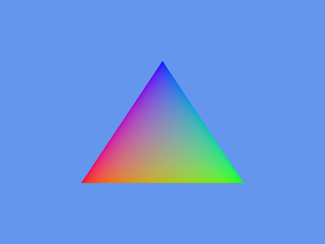
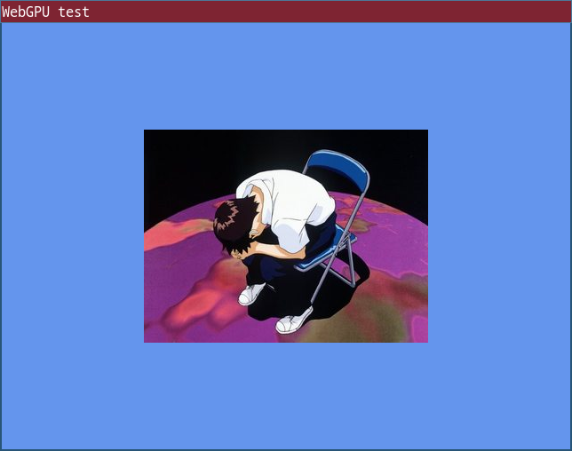
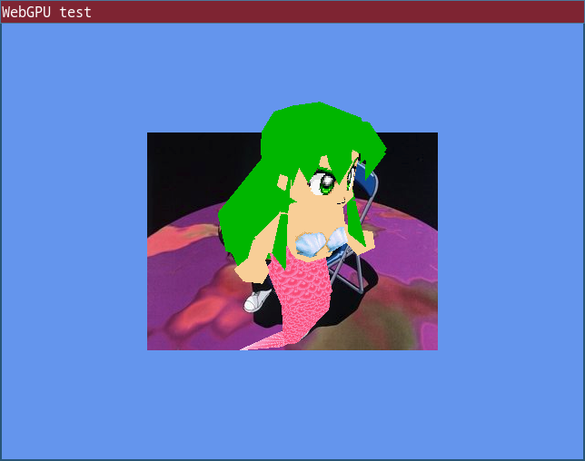

# Learning webgpu

Following this: https://eliemichel.github.io/LearnWebGPU/


19.12.23 - first triangle



20.12.23 - textured quad


20.01.24 - model


Expect a cute animated cat to appear if successful.

## Building

I'm using [SDL](https://github.com/libsdl-org/SDL) for windows/input and [Google Dawn](https://github.com/google/dawn) as a WebGPU backend. Everything is built from source.

### Install system deps (Linux)

(TODO: probably incomplete list)

```sh
sudo apt install libx11-xcb-dev
```

### Build

```sh
mkdir build && cd build
cmake ..
cmake --build .
```

## Status of WebGPU support in browsers on Linux

* Firefox Nightly (123.0) - kinda works, but WGSL support seems incomplete (e.g. `override` doesn't work)
* Chrome Unstable (122.0.6182.0) - only works when launched with `--enable-features=Vulkan,UseSkiaRenderer --enable-unsafe-webgpu`
